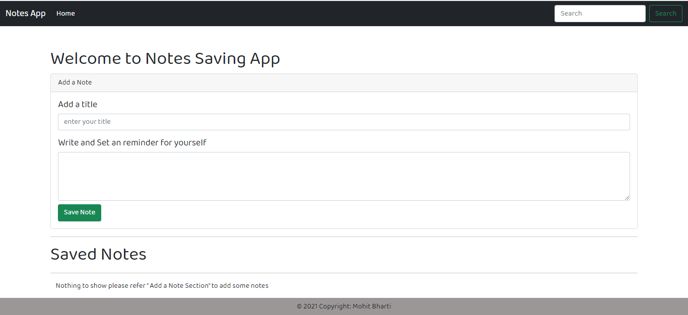
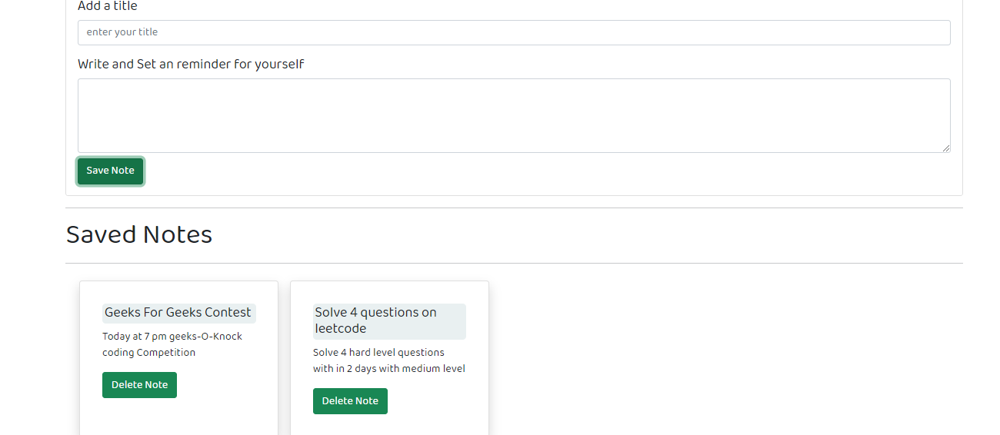
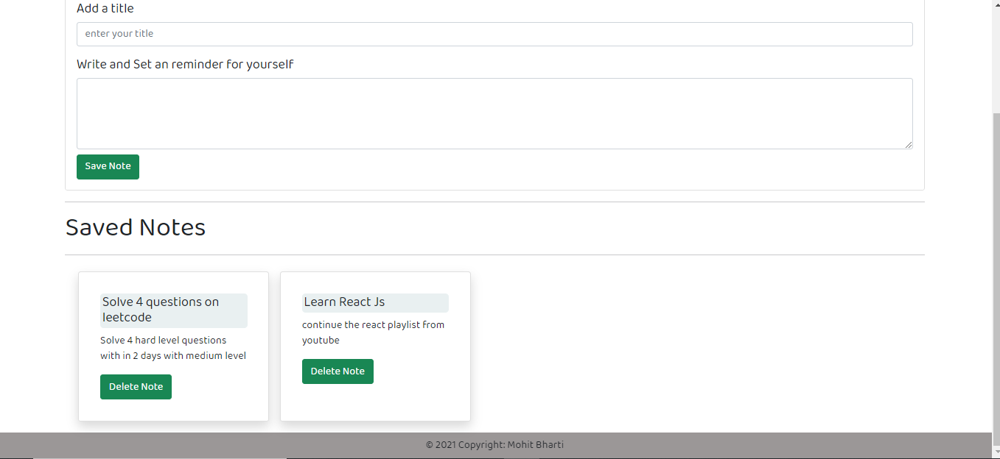

# Notes Saving website
---
** This is a Notes Saving Project created using bootstrap,Javascript **
> In this i have not used any database to store 
> all the notes will be stored in the localStorage of Js
> There is input tag to insert the title of the note and a textarea to store the information of the Note
> One can add a Note and Delete it after its completion

### Screenshots
1.

2.

3.
